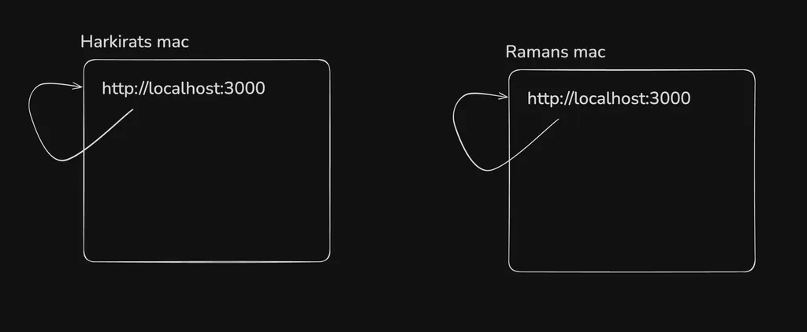
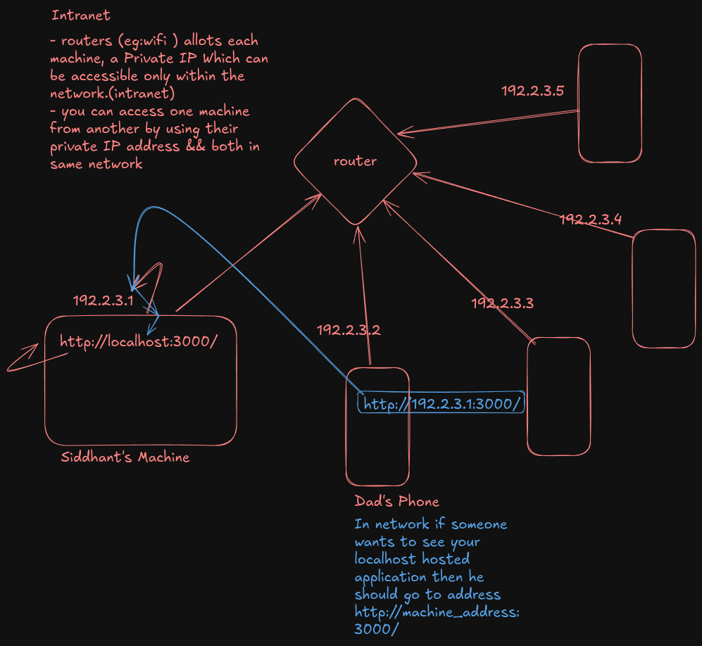
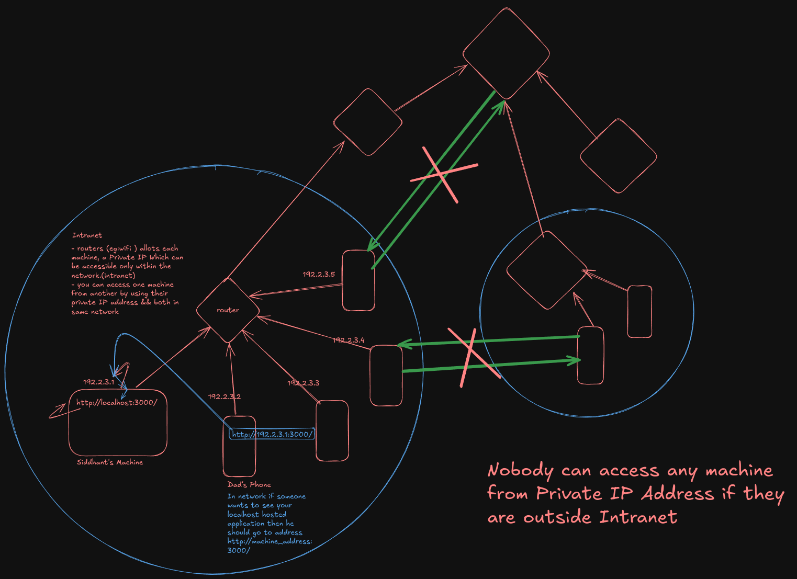
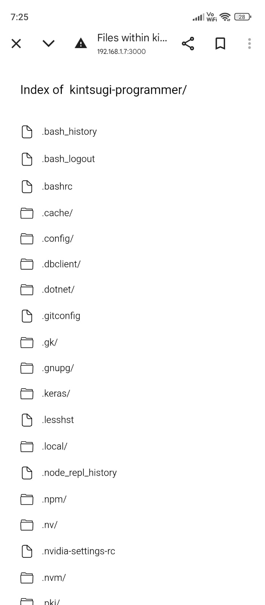
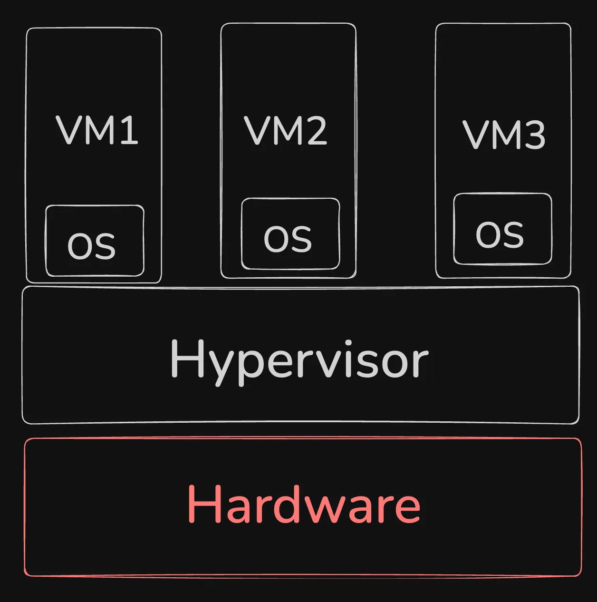
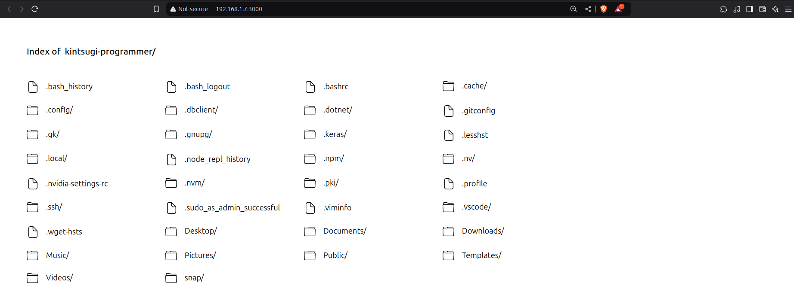
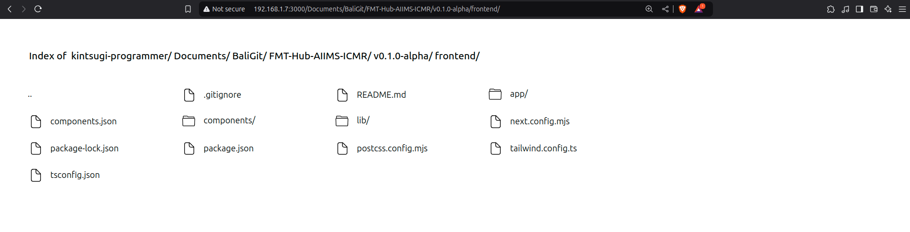
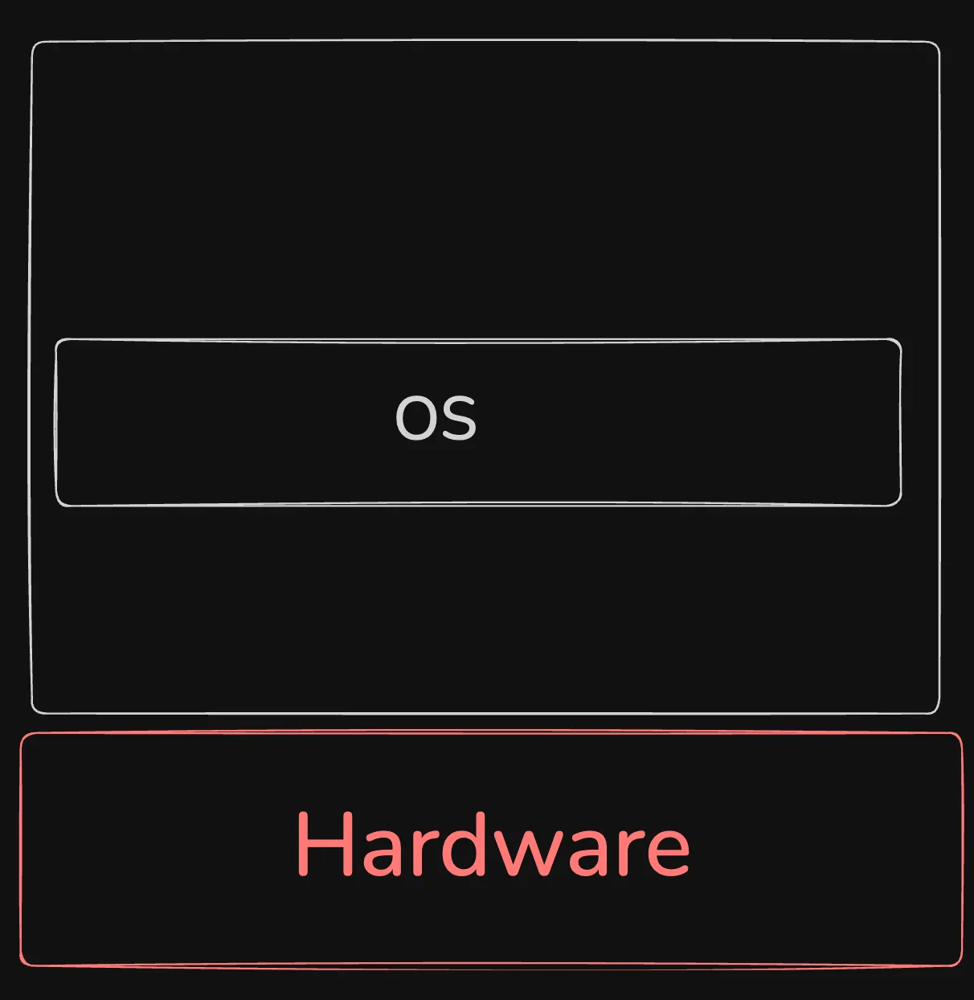
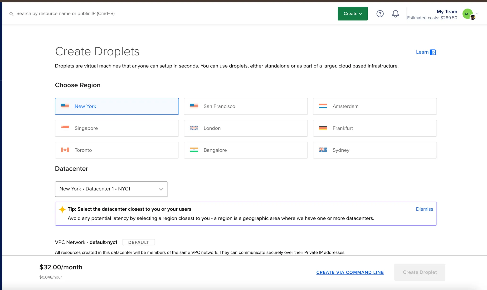
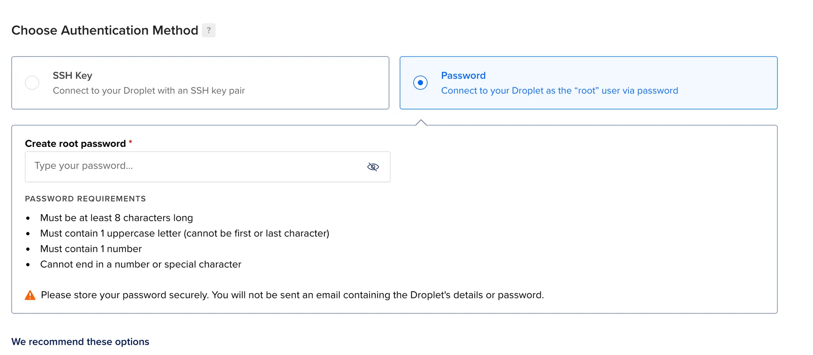

# VMs

## Why deploy on the internet, isn’t localhost enough?
- so that other people could access it.

## Domains vs IPs


### localhost
- loopback adderess that points to the machine itself
- allow to communicate over the network
- IP of localhost is 
  - 127.0.0.1 (IPv4)
  - ::1 (IPv6)
- eg usage
  - http://localhost:3000/
  - http://127.0.0.1

### ping
- Verifies IP-level connectivity to another TCP/IP computer by sending Internet Control Message Protocol (ICMP) echo Request messages. 

- eg: goggle.com (here you can see its address 2404:6800:4002:819::200e)
  ```bash
    user@machine:~$ ping google.com
    PING google.com (2404:6800:4002:819::200e) 56 data bytes
    64 bytes from del11s14-in-x0e.1e100.net (2404:6800:4002:819::200e): icmp_seq=1 ttl=117 time=9.44 ms
    64 bytes from del11s14-in-x0e.1e100.net (2404:6800:4002:819::200e): icmp_seq=2 ttl=117 time=9.31 ms
    64 bytes from del11s14-in-x0e.1e100.net (2404:6800:4002:819::200e): icmp_seq=3 ttl=117 time=13.5 ms
    64 bytes from del11s14-in-x0e.1e100.net (2404:6800:4002:819::200e): icmp_seq=4 ttl=117 time=14.3 ms
    64 bytes from del11s14-in-x0e.1e100.net (2404:6800:4002:819::200e): icmp_seq=5 ttl=117 time=17.3 ms
    ^C
    --- google.com ping statistics ---
    5 packets transmitted, 5 received, 0% packet loss, time 4005ms
    rtt min/avg/max/mdev = 9.310/12.775/17.339/3.060 ms
    user@machine:~$ 
  ```

- eg: localhost (here you can see its address 127.0.0.1)
  ```bash
    user@machine:~$ ping localhost
    PING localhost (127.0.0.1) 56(84) bytes of data.
    64 bytes from localhost (127.0.0.1): icmp_seq=1 ttl=64 time=0.011 ms
    64 bytes from localhost (127.0.0.1): icmp_seq=2 ttl=64 time=0.018 ms
    64 bytes from localhost (127.0.0.1): icmp_seq=3 ttl=64 time=0.018 ms
    64 bytes from localhost (127.0.0.1): icmp_seq=4 ttl=64 time=0.015 ms
    64 bytes from localhost (127.0.0.1): icmp_seq=5 ttl=64 time=0.020 ms
    ^C
    --- localhost ping statistics ---
    5 packets transmitted, 5 received, 0% packet loss, time 4117ms
    rtt min/avg/max/mdev = 0.011/0.016/0.020/0.003 ms
    user@machine:~$ 
  ```

### Domain name
- Unique Alias Name Mapped to an IP Address
- like Address of a house
- A **domain name** is the readable, human-friendly address we use to access websites, like `google.com` or `example.org`.
- Domains are a higher-level abstraction that makes it easier for us to remember websites instead of trying to recall a string of numbers (like an IP address).
- For instance, when you type `www.google.com` into your browser, your computer looks up that domain name and finds the corresponding IP address, then connects to the website.
- eg: google.com (here you can see its address 2404:6800:4002:819)
- eg: localhost (here you can see its address 127.0.0.1)
- eg: csbhatiya.com (here you can see its address 76.76.21.21)
### **IP (Internet Protocol) Address**
- like Lat&Long Coordinates of a house
- An **IP address** is a unique string of numbers that identifies a device on a network, like the internet. Think of it like a **house address**: it's how computers (or any devices on the network) know where to send information.
- For example, `192.168.1.1` is an IP address.
- An **IP address** is essential for routing data on the internet, but it's not the most human-friendly system.
- eg: IPv6 Address google.com : 2404:6800:4002:819::200e
- eg: IPv4 Address csbhatiya.com : 76.76.21.21
### Limited IP addresses
- IPv4 (Internet Protocol version 4) has a limited number of IP addresses 
- IPv4 Ranges : 0.0.0.0 to 255.255.255.255 (2^4 IPv4 addr)
- that's why IPv6 was created
- There are limited number of IP addresses in the world (ipv4 specially).
- Very Expensive ,only big companies like google, facebook etc can afford it.
- So it’s not very easy for us to get a public IP. Most IPs are Booked by cloud providers or Big companies (JIO)
- We Can **Rent it** from cloud providers like AWS, Google Cloud, Microsoft Azure etc.
- Internet is huge web of machines connected to each other.


## Local network, routing (mild hosting), Intranet
- routers (eg:wifi ) allots each machine, a **Private IP** (eg:192.168.1.1) Which can be accessible only within the network.(intranet)
- you can access one machine from another by using their private IP address && both in same network

- Intranet



### Steps to follow : Sample http Server

1. Start a node.js process locally on port 3000

```bash
const express = require('express');
const app = express();
const port = 3000;

app.get('/', (req, res) => {
  res.send('Hello, World!');
});

app.listen(port, () => {
  console.log(`Server is running on http://localhost:${port}`);
});
```

1. Find the IP of your machine on the local network

```bash
ifconfig or ipconfig
```

**Loopback address**
```bash
lo: flags=73<UP,LOOPBACK,RUNNING>  mtu 65536
        inet 127.0.0.1  netmask 255.0.0.0
        inet6 ::1  prefixlen 128  scopeid 0x10<host>
        loop  txqueuelen 1000  (Local Loopback)
        RX packets 13293  bytes 1795088 (1.7 MB)
        RX errors 0  dropped 0  overruns 0  frame 0
        TX packets 13293  bytes 1795088 (1.7 MB)
        TX errors 0  dropped 0 overruns 0  carrier 0  collisions 0
```
- lo0 : Loopback address

**Wifi 0 network**


```bash
wlo1: flags=4163<UP,BROADCAST,RUNNING,MULTICAST>  mtu 1500
        inet 192.168.1.7  netmask 255.255.255.0  broadcast 192.168.1.255
        inet6 2401:4900:8844:fd3c:246f:3006:3526:fe6c  prefixlen 64  scopeid 0x0<global>
        inet6 2401:4900:8844:fd3c:6642:d776:4576:d8b6  prefixlen 64  scopeid 0x0<global>
        inet6 fe80::7b31:a4fe:f534:4eec  prefixlen 64  scopeid 0x20<link>
        ether f4:26:79:97:34:f2  txqueuelen 1000  (Ethernet)
        RX packets 612773  bytes 702750654 (702.7 MB)
        RX errors 0  dropped 0  overruns 0  frame 0
        TX packets 168871  bytes 52045238 (52.0 MB)
        TX errors 0  dropped 0 overruns 0  carrier 0  collisions 0
```
If I go to 192.168.1.7:3000 on my phone, I should be able to visit the website


### Hosts file

You can override what your domain name resolves to by overriding the hosts file.
- if you put custom domains,then instead of searching domains in internet ,i will direct to this.
- don't touch this file too much as if you forgot to reset it, you may find yourself in some problem
```bash
vi /etc/hosts
127.0.0.01	harkirat.100xdevs.com
```
```bash
  GNU nano 7.2                             /etc/hosts                                      
127.0.0.1 localhost
127.0.1.1 kintsugi-machine

# The following lines are desirable for IPv6 capable hosts
::1     ip6-localhost ip6-loopback
fe00::0 ip6-localnet
ff00::0 ip6-mcastprefix
ff02::1 ip6-allnodes
ff02::2 ip6-allrouters


                            [ File '/etc/hosts' is unwritable ]
^G Help        ^O Write Out   ^W Where Is    ^K Cut         ^T Execute     ^C Location
^X Exit        ^R Read File   ^\ Replace     ^U Paste       ^J Justify     ^/ Go To Line
```


### Can you think of how you can phis your friend into giving their credentials by using this approach?
- one idea proposed (hypothetical and unethical)
  - make facebook fake lookalike (same css)
  - and redirection to actual facebook after getting login credentials
  - and setup
```bash
    vi /etc/hosts
    127.0.0.01	facebook.com
```
  
### npx serve
```bash
user@machine:~$ npx serve
Need to install the following packages:
serve@14.2.4
Ok to proceed? (y) y


   ┌─────────────────────────────────────────┐
   │                                         │
   │   Serving!                              │
   │                                         │
   │   - Local:    http://localhost:3000     │
   │   - Network:  http://192.168.1.7:3000   │
   │                                         │
   │   Copied local address to clipboard!    │
   │                                         │
   └─────────────────────────────────────────┘

```
### Problem with Mild hosting in local network
- vunerable anyone can get into machine if inside router
- 
- 
- portscan can find ports like this
```bash
sudo nmap -n -PN -sT -sU -p- localhost
```
```bash
user@machine:~$ sudo nmap -n -PN -sT -sU -p- localhost
[sudo] password for kintsugi-programmer: 
Starting Nmap 7.94SVN ( https://nmap.org ) at 2025-01-30 19:30 IST
Nmap scan report for localhost (127.0.0.1)
Host is up (0.000020s latency).
Not shown: 65533 closed udp ports (port-unreach), 65532 closed tcp ports (conn-refused)
PORT      STATE         SERVICE
631/tcp   open          ipp
8828/tcp  open          unknown
27121/tcp open          unknown
5353/udp  open|filtered zeroconf
37843/udp open|filtered unknown

Nmap done: 1 IP address (1 host up) scanned in 3.11 seconds
user@machine:~$ 
```
## How to deploy apps (actual hosting)?

1. Renting servers on a cloud
   1. expensive
   2. like Zepto, Netflix
   3. easy
2. Rending compute yourself in datacenters
   1. buying somelike10 machines from TATA
   2. like AWS bought machines from TATA
   3. like Civo bought machines from TATA
3. Self hosting (buying a CPU rack in your house)
   1. like dukaan ,arpit show it
   2. complex
   3. cheap
4. Serverless providers
5. Cloud native options (k8s)

[ ] Great video to look at [YTvideo](https://www.youtube.com/watch?v=gViEtIJ1DCw)

## VMs - Buying Big 2 Machines or 10 Small Machines
- with Hypervisor(it's a software): 1 machine can be 10 small machines
- Multiple Workloads in single server
- many times companies chooses specific server to increase seemless connectivity
- like buying server in japan as its near japanese people,thus easy & Fast

VMs run on a physical server (called the **host**) but are abstracted through a layer of virtualization software called a **hypervisor** (e.g., VMware, KVM). This hypervisor divides the host machine’s resources (CPU, memory, storage) into separate virtual machines.

Each VM acts like a completely independent machine, even though they share the underlying hardware. You can run different operating systems and applications in different VMs on the same physical server.

VMs are highly flexible and easy to scale. You can quickly spin up, modify, or delete VMs, and you can consolidate multiple workloads on a single server.

The virtualization layer introduces a slight overhead in terms of performance because the hypervisor needs to manage resources and ensure each VM operates independently. However, with modern hypervisors and powerful hardware, this overhead is minimal.

## Bare metal servers
- No VMs
- Pure Machine 
- Pure CPUs >> Virtual CPUs
- But VVVExpensive ,almost all prebooked for months
- https://www.latitude.sh/
- all crypto people buy it
I- n a bare-metal setup, an operating system (OS) runs directly on the physical hardware without a hypervisor in between. There’s no virtualization layer.

- Since there's no hypervisor, bare-metal systems tend to offer better performance, as the OS can directly access all the server’s resources without sharing them with other instances. 
- This is especially important for high-performance applications like large databases, gaming servers, or mining crypto where VMs Fails
- reason people buy bitcoin mining machines and run at home
With bare-metal, you’re typically limited to the resources (CPU, memory, storage) of the actual physical server. You can't dynamically allocate resources like you can in a VM.

## SSH protocol, password based auth
The **SSH protocol** (Secure Shell) is a cryptographic network protocol that allows secure communication between two systems, typically for remote administration. It’s most commonly used to log into remote servers and execute commands, but it also facilitates secure file transfers and other operations.

### Key Features of SSH:

1. **Encryption**: SSH encrypts the data that’s sent between the client and the server, so even if someone intercepts the connection, they can’t read the data. This makes it much more secure than older protocols like Telnet or FTP, which transmit data in plaintext.
2. **Authentication**: SSH can use two methods of authentication:
    - **Password-based**: You enter a password to authenticate yourself to the remote system.
    - **Public Key-based**: A more secure method, where the client uses a private key to authenticate, and the server checks it against the corresponding public key. This eliminates the need for passwords and provides an extra layer of security.
3. **Integrity**: SSH ensures the integrity of data, meaning that data cannot be tampered with while it’s in transit. If someone tries to alter the data being sent, the connection will be immediately disrupted.
### Password based

While setting up a server, select password based authentication

**Example from `digitalocean`** 



```solidity
ssh ubuntu@SERVER_IP
or
ssh root@SERVER_IP
```